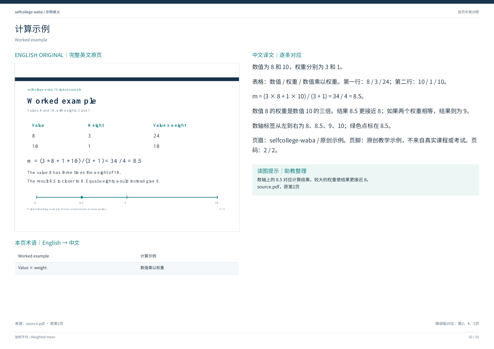
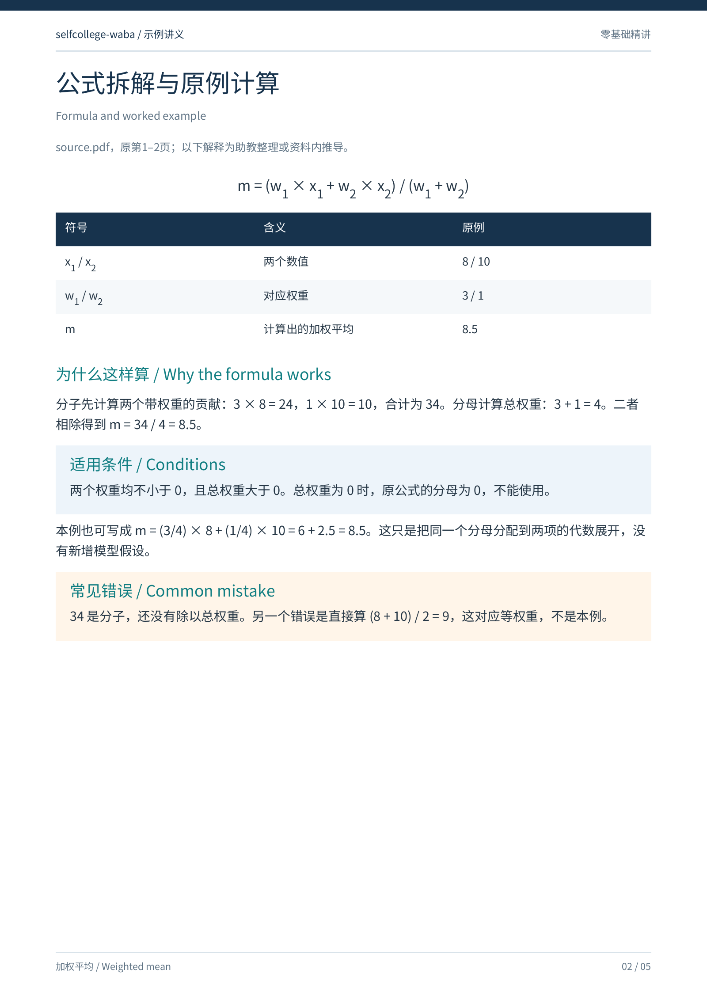
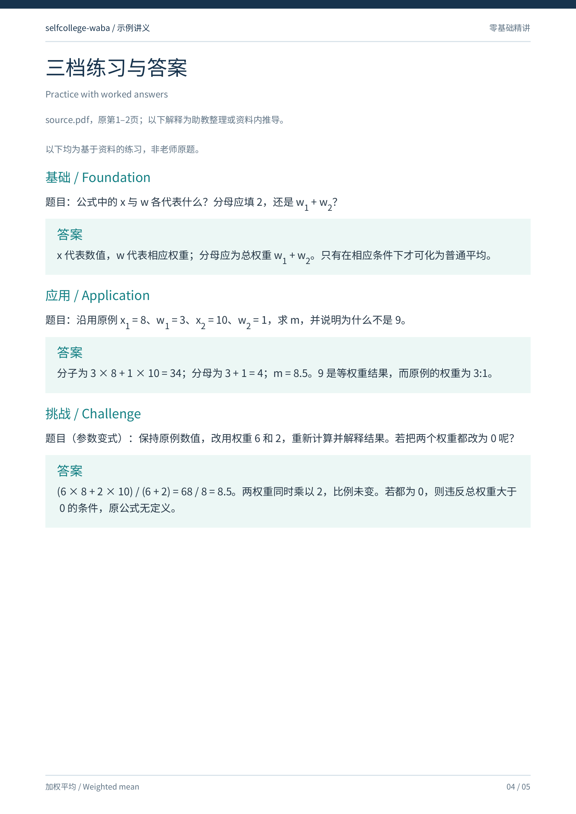

<div align="center">

# selfcollege-waba

### 课件上的每一步，都值得讲明白。

把一份课件变成两份能跟着学的 PDF：**逐页对照 · 零基础精讲**

保留原页｜拆开公式｜练习附答案｜课堂重点回到对应页

**[⬇ 下载 selfcollege-waba.zip](https://github.com/RivanXU/selfcollege-waba/releases/latest/download/selfcollege-waba.zip)** · **[看看成品](#看看成品)** · **[开始使用](#开始使用)**

</div>

公式看到了，答案也有了，可中间那一步还是没跟上。

`selfcollege-waba` 是一套交给 AI 使用的课程学习 Skill。把课件放进来，它会按学习流程组织翻译、讲解、练习和复习材料。你可以对着原页读，也可以停在某个符号、某条曲线、某一步推导，继续追问。

**从“这一页在说什么”，一步步走到“这道题我会做”。** 适合大学课程，也适合有成套资料的自学；课程、讲解语言和起点由你决定。

## 看看成品

下面三张图直接截自包内的原创“加权平均”示例。点开图片可看大图，也可以下载完整 PDF，看看讲解深度和排版是否适合自己。

### ① 原稿在左，译文和理解提示在右

上课跟到哪一页，就读到哪一页。原文、公式和图表保留在同一张纸上，术语和易错点在旁边解释。

[](examples/previews/comparison.png)

**[打开逐页对照 PDF](examples/逐页对照.pdf)** · [查看英文原稿](examples/source.pdf)

### ② 公式拆开讲，练习接着做

精讲版按知识模块展开：先弄懂符号和条件，再跟着例题计算，最后检查自己是否能独立应用。题后直接附答案和理由，卡住时能找到具体是哪一步。

<table>
  <tr>
    <th width="50%">公式里的每个符号，都有解释</th>
    <th width="50%">从基础理解，走到条件与边界</th>
  </tr>
  <tr>
    <td><a href="examples/previews/explanation.png"></a></td>
    <td><a href="examples/previews/practice.png"></a></td>
  </tr>
  <tr>
    <td>精讲示例 · 第 2 页</td>
    <td>精讲示例 · 第 4 页</td>
  </tr>
</table>

**[打开零基础精讲 PDF](examples/零基础精讲.pdf)**

示例原稿 2 页、逐页对照 2 页、精讲 5 页。示例不含真实课堂录音或个人学习资料；其他课程的精讲页数随内容而定。

## 它会怎样陪你学

| 你现在的状态 | 可以交给它的任务 |
| --- | --- |
| “每页都看了，还是不知道整讲在干什么。” | 先建立知识地图，说明模块的关系和学习顺序。 |
| “英文读得懂，专业意思却没读懂。” | 在完整原页旁翻译，补上“英文原词＋中文解释”和简明提示。 |
| “老师从这一步直接跳到了下一步。” | 拆解公式、条件和推导；图表逐个解释坐标、标签与结论。 |
| “看答案会，自己做就卡住。” | 安排基础、应用、挑战练习，配步骤、答案和常见错误。 |
| “录音转写很乱，我只想找老师强调的地方。” | 结合课件清理转写，将有依据的课堂重点批注回对应页；不确定处明确标注。 |
| “下一次学习，能接着这里来吗？” | 保存课程档案；下次读取可访问的档案，接续进度、术语和偏好。 |

每讲最后，还会整理**一页式框架、关键词、必会内容、易错清单和题型—方法表**，方便回头复习。

讲解默认以你提供的资料和可核验推导为依据，保留来源定位。自拟练习会标注，转写中的推断会标注，资料不足也会说明；没有依据时，不会把内容写成“老师强调”或“必考”。

## 开始使用

### 第一步：下载完整包

**[下载 selfcollege-waba.zip](https://github.com/RivanXU/selfcollege-waba/releases/latest/download/selfcollege-waba.zip)**，解压后得到 `selfcollege-waba` 文件夹。保留整个文件夹，里面的学习规则、参考文档、PDF 工具和中文字体需要一起使用。

### 第二步：选择适合你的入口

| 你使用的工具 | 怎么开始 |
| --- | --- |
| 支持本地 Skill 的 Codex CLI / IDE | 按下面的目录说明安装，再选择 `$selfcollege-waba`。 |
| 有 Skill 导入入口的 AI 应用 | 按该应用要求导入完整文件夹或 ZIP，再从技能列表中选择它。 |
| 只有文件上传和聊天入口 | 打开[完整学习提示词](references/master-prompt.md)，复制“可复制提示词”及其后续内容，与课件一起发给 AI。 |

<details>
<summary><strong>展开：Codex 本地安装位置</strong></summary>

把完整文件夹放进当前学习项目的 `.agents/skills/`，使入口位于：

```text
.agents/skills/selfcollege-waba/SKILL.md
```

`agents/`、`assets/`、`references/`、`scripts/` 等目录仍保留在 `selfcollege-waba/` 内。不要多套一层同名文件夹。

这样只在当前项目中使用。希望本人所有项目都能使用时，可以改放在 `~/.agents/skills/`；同一作用范围保留一份安装即可。若技能列表未更新，先检查目录层级和文件完整性，再刷新或重新打开技能列表。

安装位置及调用方式见 [OpenAI 官方 Skill 文档](https://learn.chatgpt.com/docs/build-skills)。在支持 Skill 的 ChatGPT 界面中，可用 `@` 选择技能；在 Codex CLI / IDE 中使用 `$` 或技能选择器。

</details>

不同应用的导入方式和文件能力不同。**生成可下载 PDF，需要所用 AI 能读取附件、执行排版工具并交付文件。** 仅支持文字的环境可先按相同流程生成可导出的讲义内容。

### 第三步：上传一讲课件，发出第一句话

选择技能后，把下面这段发给 AI 就可以开始：

> 帮我学习这份课件。我希望用中文讲解并保留英文术语，请生成逐页对照 PDF 和零基础精讲 PDF。先把这一讲的框架讲清楚，公式不要跳步骤，练习后直接给答案。

首次使用只需说明课程、学习范围和讲解语言；学校、专业、学习阶段可选填。只有课件也能开始，课堂转写可以课后再补。

## 卡在哪里，就从哪里问

不必每次重新写一大段要求。像平时问助教一样说就好：

- **看公式：**“第 8 页的下标分别指谁？这一步为什么成立？”
- **看图：**“先解释横纵坐标，再带我读懂这条曲线。”
- **补课堂内容：**“这是今天的转写，把老师强调的地方批注回对应页。”
- **调整节奏：**“我基础比较弱，这门课多讲推导，答案紧跟题目。”
- **继续下一讲：**“这是上次的课程档案和新课件，请接着学习。”
- **先建课程框架：**“这是大纲和全部课件，先建立课程地图。”

## 常见问题

**需要 API Key 或服务器吗？使用成本是什么？**

不需要自己申请 API Key、部署服务器或联网激活。这个 Skill 可以在许可证允许的非商业用途下下载和使用；你使用的 AI 应用可能有订阅费用、额度或文件能力限制，以该应用为准。

**一定要英文课件、大学课程或课堂录音吗？**

都不必。默认英文配中文，其他语言可按需要调整；中文资料可做原文对照与注释。大学课程和系统自学都可以使用。没有转写时先完成课件学习，不补写教师发言。

**PPTX 或扫描版课件能用吗？**

PPTX 需要先转换并核对页数，扫描件需要可靠的识别和看图能力。能处理到什么程度取决于所用环境；模糊公式、缺失内容会标为疑点。课件很多时，可以先建档，再按讲学习。

**换一个对话，它还记得我吗？**

接续依赖实际保存且可访问的课程档案。把档案留在同一课程空间，或在新对话中重新提供；不同课程分别保存。收到讲义只代表材料已制作，掌握程度还要看你的理解与练习。

**资料会传给作者吗？**

包内没有作者服务器或遥测程序。课件、转写、讲义和档案保存在你的学习空间，与 Skill 文件分开。所用 AI 应用如何处理上传内容，由该应用的设置和条款决定。

<details>
<summary><strong>PDF 工具、依赖与文件校验</strong></summary>

生成器是 [`scripts/render_study_pdfs.py`](scripts/render_study_pdfs.py)，输入格式和版式调整见 [PDF 使用说明](references/pdf-style.md)。通常由 AI 准备内容并调用工具，不需要自己写内容清单。

本地运行需要 Python 与 [`requirements.txt`](requirements.txt) 中的两个依赖。可以让 AI 在当前项目的独立环境中安装所需依赖。中文字体已随包提供。

工具负责排版，翻译、讲解和答案由 AI 基于资料撰写，仍需核对来源与计算。复杂数学、特殊文字方向或密集页面可能需要其他排版工具。

解压后可在文件夹内运行：

```bash
python3 scripts/verify_package.py
```

校验检查文件是否与随包清单一致；确认来源时，请从作者仓库获取下载包。

</details>

## 使用许可与反馈

Copyright (c) 2026 RivanXU.

原创内容采用 **[PolyForm Noncommercial](LICENSE)**。可以在许可证允许的非商业用途下使用、修改和分享；再分发时须保留许可证与 [NOTICE](NOTICE) 中的必要声明。许可证明确允许的机构用途，按原文条款判断；超出许可范围的商业用途需另行授权。

这是附带非商业使用条件的公开源码项目。名称和署名用于说明来源，不表示修改版或第三方服务获得作者背书。第三方依赖见[第三方声明](THIRD_PARTY_NOTICES.md)，课件和教材仍适用各自原有版权。

遇到安装问题，或有一页“怎么讲都没讲明白”？欢迎到 [Issues](https://github.com/RivanXU/selfcollege-waba/issues) 告诉我所用工具、操作步骤和期待的效果。贴示例前，请去掉个人信息，并确认资料可以公开分享。授权咨询也可以通过 Issues 或 [作者主页](https://github.com/RivanXU) 上的公开渠道联系。

如果它帮你读懂了某一页，也欢迎点一个 **Star**，让下一位卡在这里的同学更容易找到它。
